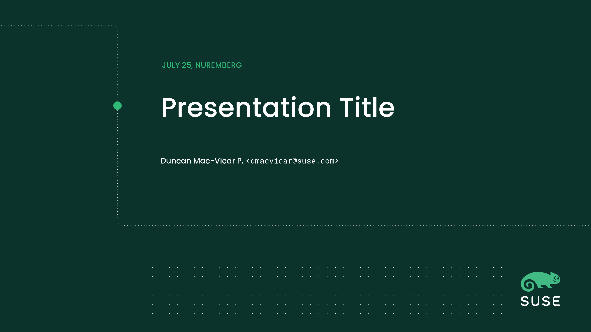
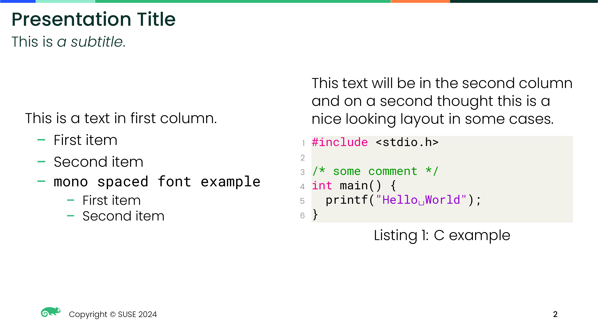
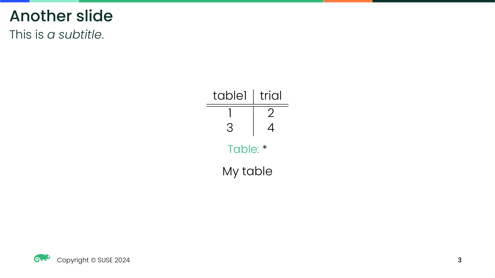

# LaTeX Beamer SUSE template

Presentation template for Beamer inspired in the [SUSE Brand](https://brand.suse.com/) guidelines.







([PDF example](build/example.pdf))

# Why beamer?

* Office suites tend to be a pain for programmers
* It can be used from LaTeX, [org-mode](https://orgmode.org/), and [pandoc](https://pandoc.org/)

# Note

* This is a work in progress. Many styles do not comply yet with the branding guideline.
* This theme only works in 16:9

# Usage

You can install the theme system-wide in your Texlive distribution by installing <del>[this package](http://software.opensuse.org/download/package?project=home:dmacvicar&package=texlive-beamertheme-suse)</del> (package is obsolete, see the variant below).

As an alternative, put your slide next to [beamerthemesuse.sty](beamerthemesuse.sty) and the included assets (`*.eps` files).

If you install from the package, the Poppins and Roboto Mono fonts will be installed. Otherwise you will need to install them yourself:

```
# openSUSE Tumbleweed
$ zypper in google-poppins-fonts google-roboto-mono-fonts
# openSUSE Leap 15.4
$ zypper in google-poppins-fonts texlive-roboto
```

See the LaTeX source of the included [example](example.tex) to get started.

# Contributing

If you have fixes to make it closer to the guidelines, send a PR.

# Author

* Duncan Mac-Vicar P.

# License

The LaTeX code and scripts are licensed under the MIT license.

SUSE and the SUSE logo are registered trademarks of SUSE LLC in the United States and other countries. All third-party trademarks are the property of their respective owners.
